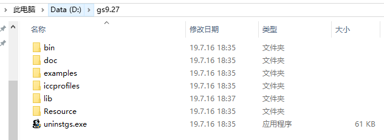
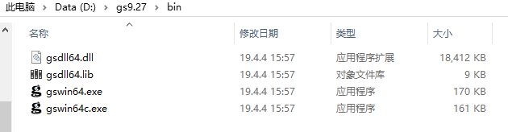
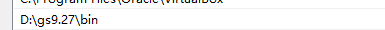
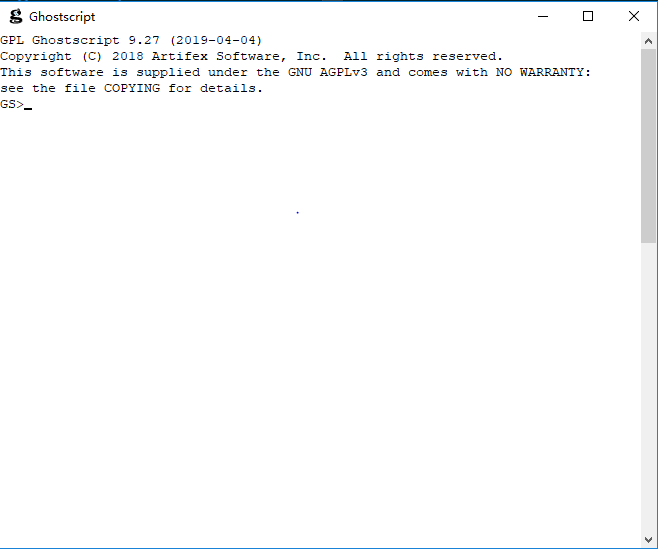
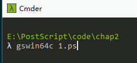
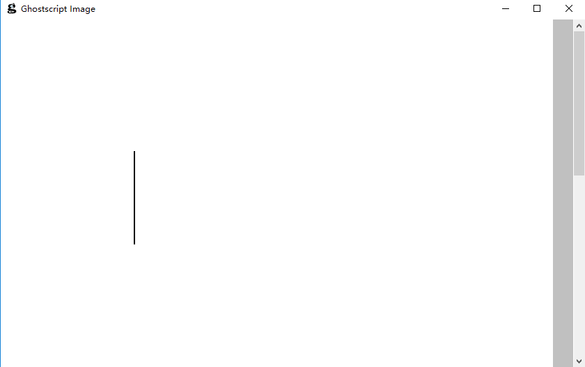

## 环境安装

### 1 ghostScript
- 1 [下载ghostScript](https://www.ghostscript.com/download.html)
- 2 安装到`gsPath` 
 


- 3 其中bin目录包含可执行文件



- 4 添加`gsPath/bin/`到环境变量



- 5 命令行执行`gswin64`打开`gs`界面


  
### 2 vscode
- 1 [下载vscode](https://code.visualstudio.com/)
- 2 下载插件`PostScript Language`,这个插件语法高亮提示
- 3 配置编译任务(task.json)
```
{
    // See https://go.microsoft.com/fwlink/?LinkId=733558
    // for the documentation about the tasks.json format
    "version": "2.0.0",
    "tasks": [
        {
            "label": "build",
            "type": "shell",
            "command": "gswin64c",
            "args": [
                "${fileBasename}"
            ],
            "presentation": {
                "echo": false,
                "reveal": "always",
                "focus": false,
                "panel": "shared",
                "showReuseMessage": true,
                "clear": false
            },
            "problemMatcher": []
        }
    ]
}
```
- 4 打开文件夹编写代码如下
```
%1.ps
newpath
    144 72 moveto
    144 432 lineto
stroke
showpage
```
- 5 当前目录打开命令行,输入`gswin64c 1.ps` 


