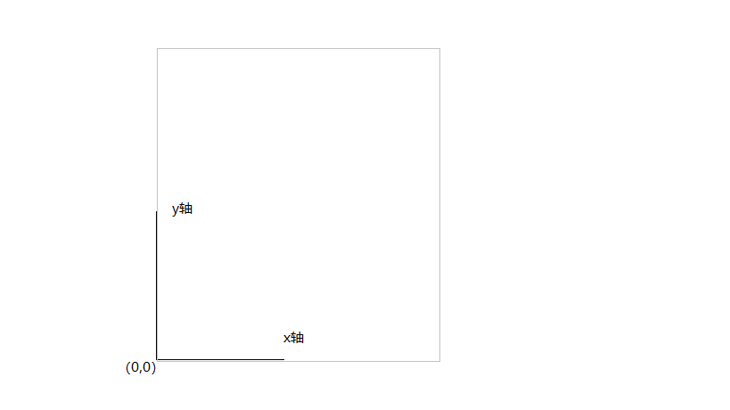
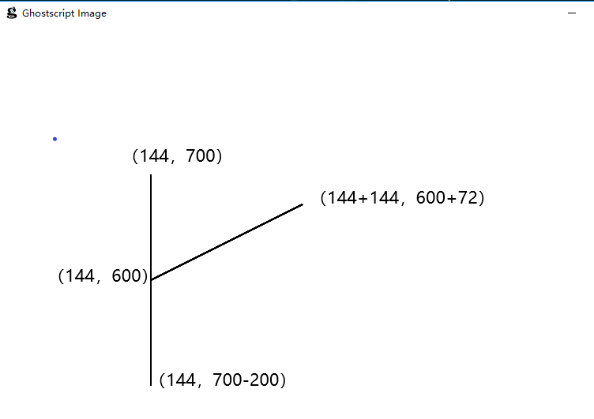
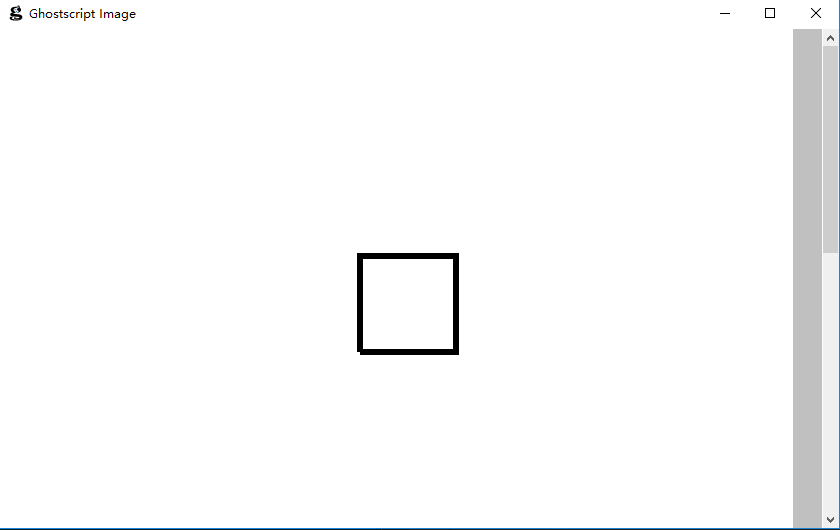
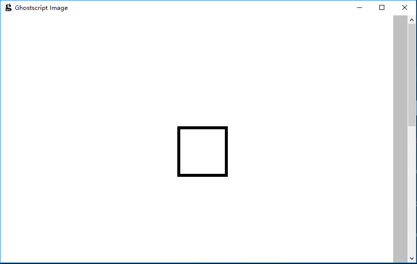
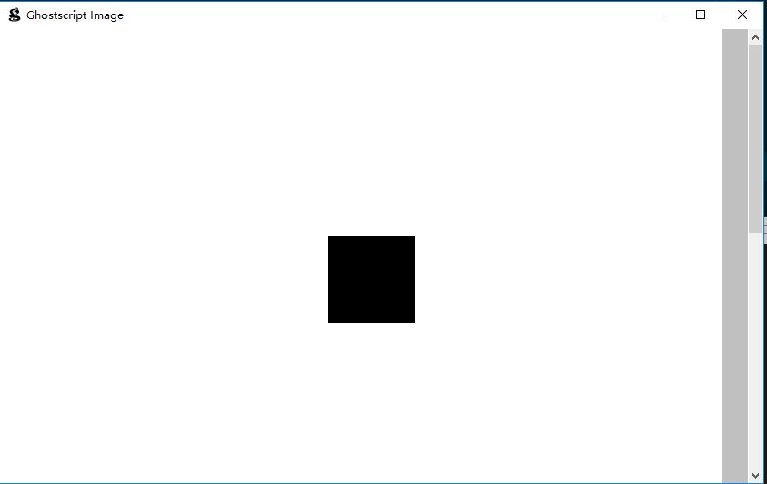
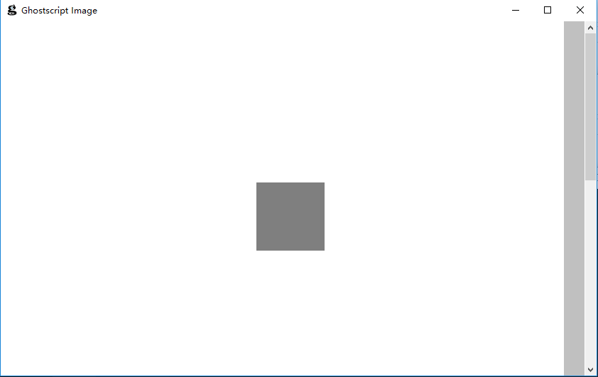
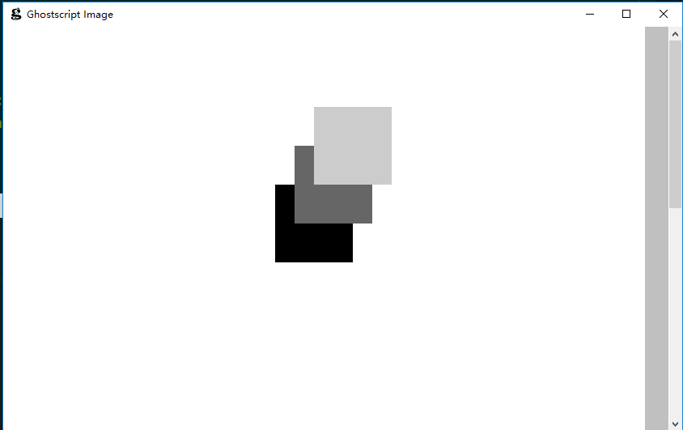

[TOC]
- ghostscript坐标系统
- lineto    简单线条
- rline     相对坐标
- box       盒子
- closepath 结束路径
- fill      填充
- setgray   设置填充色

## ghostscript坐标系统
- 当前左下角为原点(0,0)
- x轴水平向右
- y轴垂直向上



## lineto 简单线条
```postscript
%code/1.ps
newpath
    144 600 moveto
    144 700 lineto
stroke
showpage
```
- `%`开始注释行
- `newpath`开始执行路径
- `144 600 moveto`移动到(x,y)的`144,600`位置
- `144 700 lineto`从当前坐标连线到`144,700` 
- postscript使用后缀语法格式,这里的`144,600`会先进入操作栈
- 然后`moveto`,`lineto`从操作栈读取两个操作数,
- 第一个操作作为x参数,第二个操作数作为y参数
- postscript的栈操作在下一节详细描述
- `stroke`进行描边处理,`showpage`输出图像
  
## rlineto 相对坐标
```
%code/2.ps
newpath
    144 600 moveto
    144 72 rlineto
    144 700 moveto
    0 -200 rlineto
stroke
showpage
```
- `144 600`移动坐标到`144 600`
- `144 72 rlineto`连线到当前坐标`144 600`上的偏移量
- 也就是`(144+144,600+72)`



## box 盒子
```
%code/3.ps

newpath
    270 600 moveto
    0 72 rlineto
    72 0 rlineto 
    0 -72 rlineto
    -72 0 rlineto
    4 setlinewidth
stroke showpage
```
- 四条长度相等方向90度的`rlineto`构成一个盒子



- 线条最后合并的时候没有完全融合
- 通常使用`closepath`可以完全融合

## closepath 结束路径合并线条
```
%code/4.ps 

newpath
    270 600 moveto
    0 72 rlineto
    72 0 rlineto
    0 -72 rlineto
    closepath
    4 setlinewidth
stroke showpage
``` 



## fill 填充图形
```
%code/5.ps 

newpath 
    270 600 moveto
    0 72 rlineto
    72 0 rlineto
    0 -72 rlineto
closepath
fill showpage
```
- `stroke`沿着路径描边
- `fill`在封闭的路径中填充特定颜色，默认黑色



## setgray 设置填充颜色

```
%code/6.ps

newpath
    270 600 moveto
    0 72 rlineto
    72 0 rlineto 
    0 -72 rlineto
closepath

.5 setgray
fill
showpage
```
- `setgray` 设置填充颜色
  


## 图形覆盖
```
%code/7.ps
newpath
    252 624 moveto
    0 72 rlineto
    72 0 rlineto
    0 -72 rlineto
closepath fill
newpath 
    270 660 moveto
    0 72 rlineto
    72 0 rlineto
    0 -72 rlineto
closepath .4 setgray fill 

newpath 
    288 696 moveto
    0 72 rlineto
    72 0 rlineto
    0 -72 rlineto
closepath .8 setgray fill 

showpage
```
- ps中多个图形在坐标上重叠时,后面的覆盖在前面的上面

